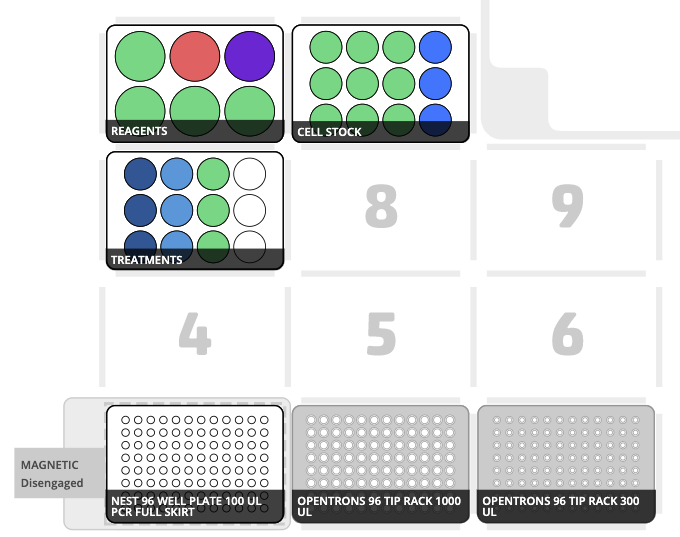
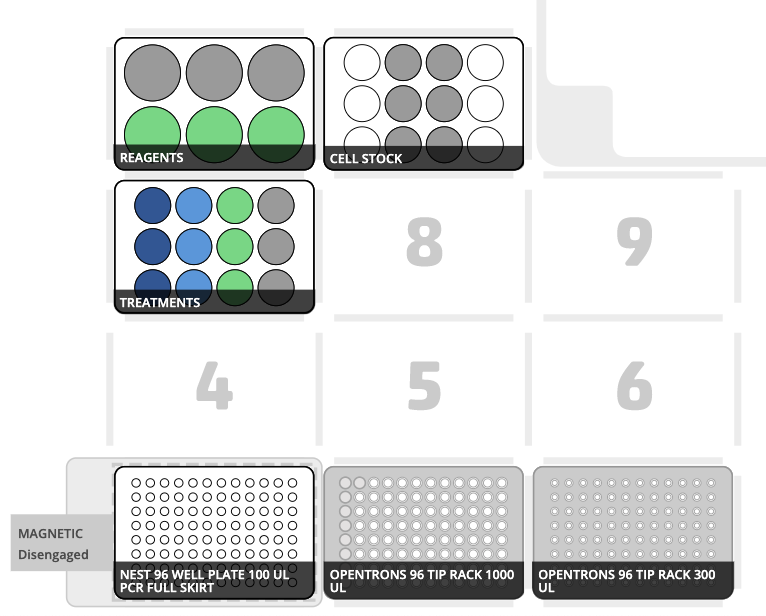
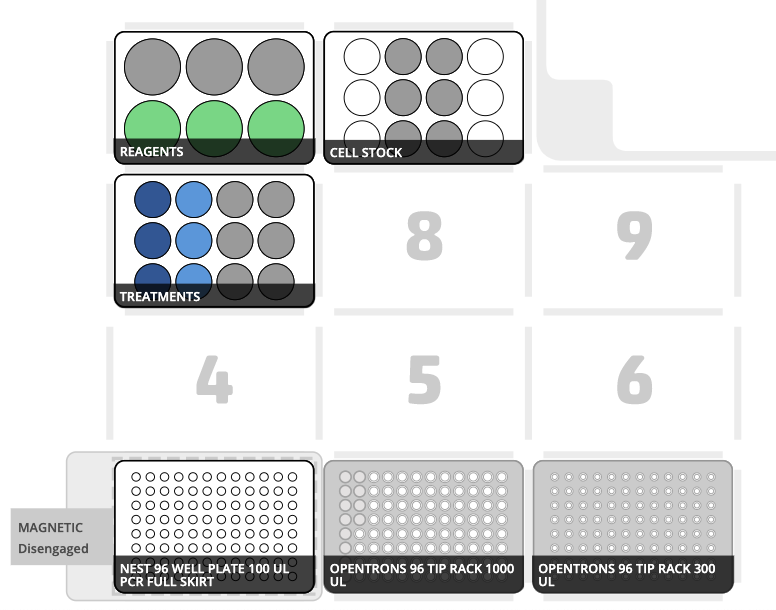
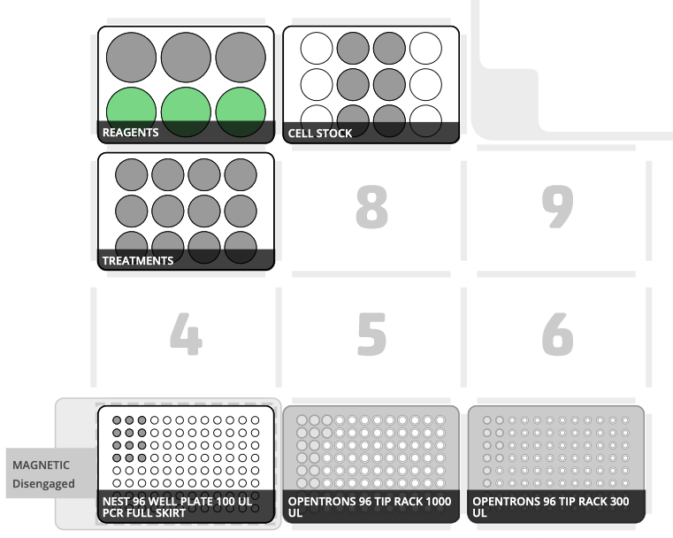

# Initial State
Dilute the cell stock. 

# State at step 6
Mix cells and reagents. 

# State at step 7
Broadcast cells over treatment groups. 

# State at step 11
Transfer final solution to the magsep. 

